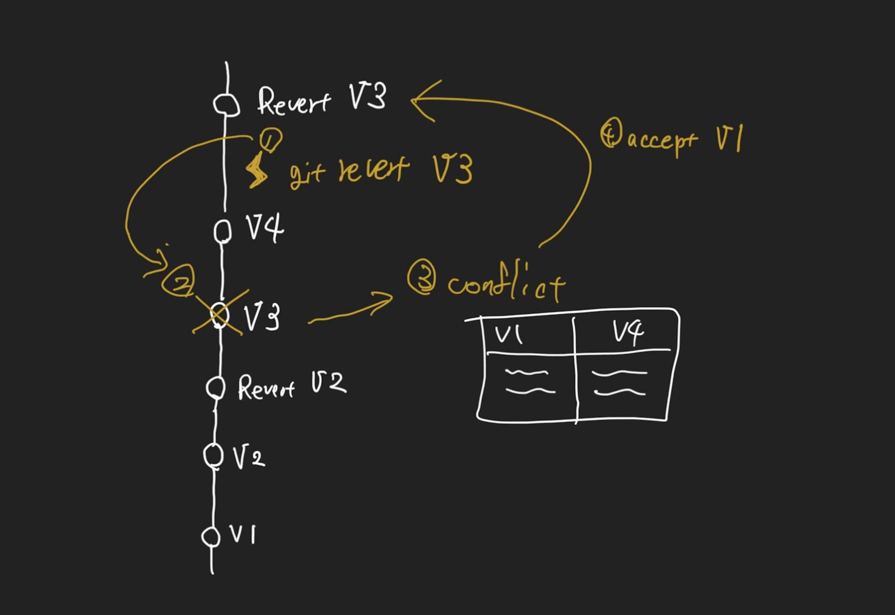
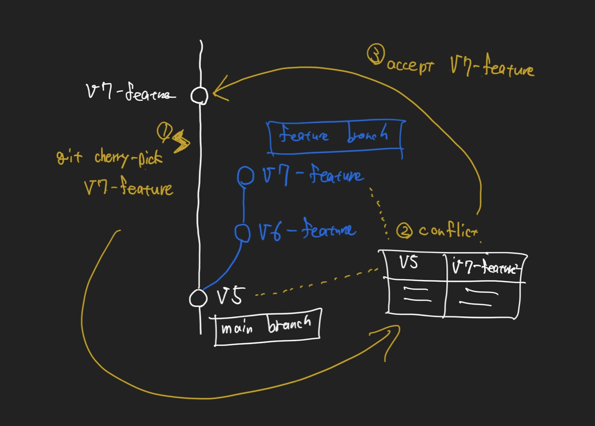
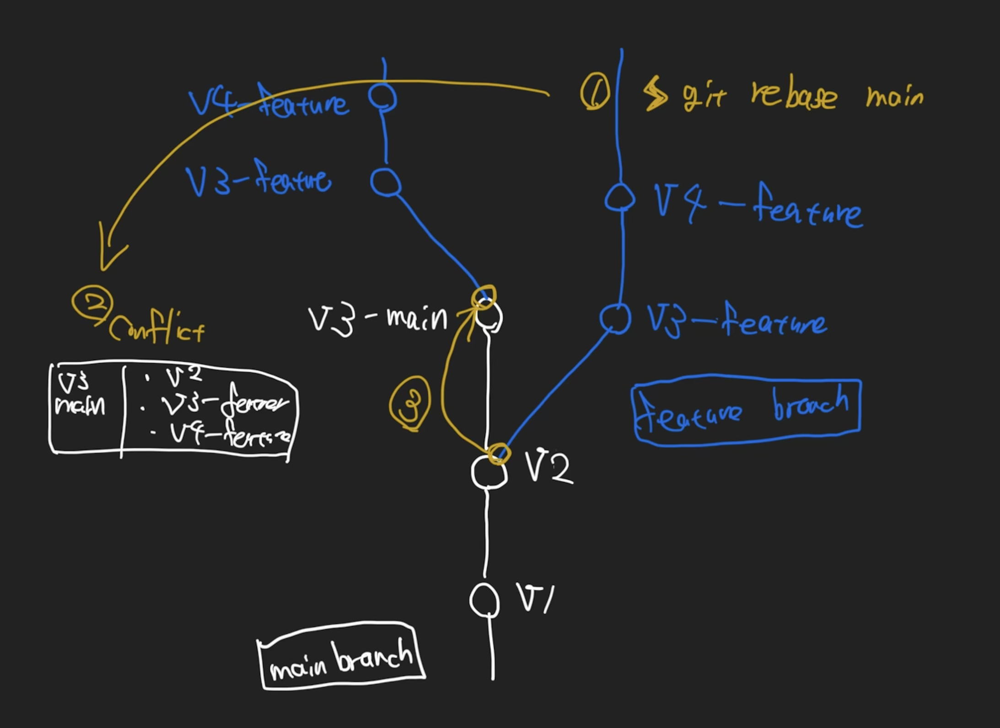

### 1.revert

（元の状態に戻る、re(後ろ)、vertere(向く)）

V3 のコミットを取り消したい。

### 2.cherry-pick

feature ブランチの V7 コミットだけを取り込みたい。

### 3.reset

V9/V10 のコミットを取り消したい。

### 4.rebase

（再度基盤（ベース）を変える、re（再度）、base（基盤、土台））

=> ブランチの基点（ベース）を別のコミットに置き換える

最新の main ブランチにあるコミットを取り込みたい。

